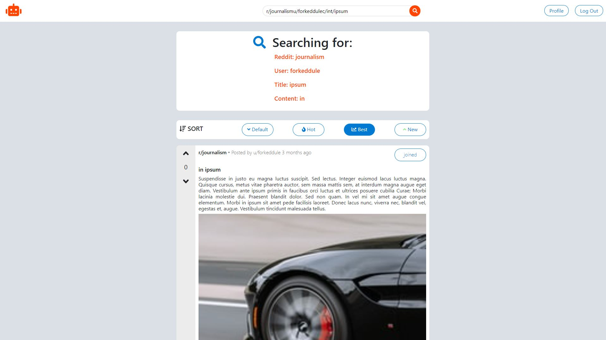
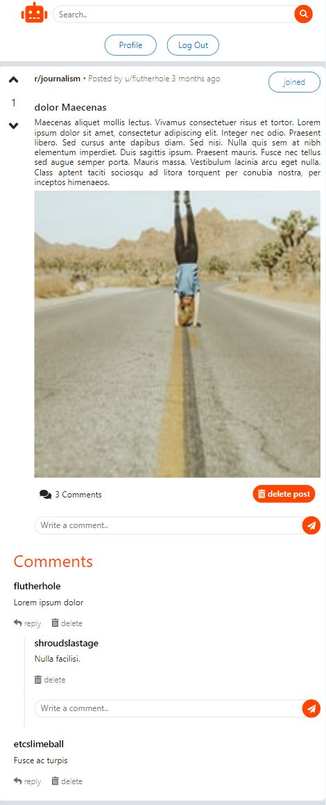
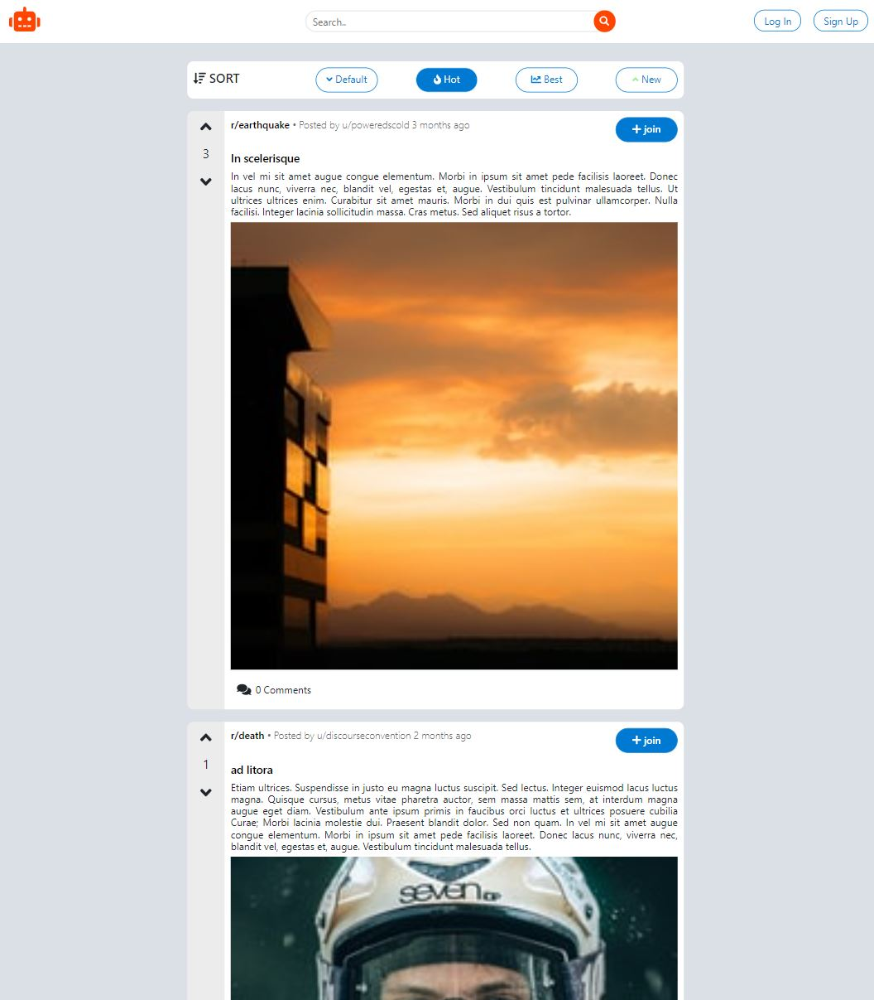

## MicroReddit
Web application inspired by the popular website - Reddit


### Technologies


- JavaScript
- frontend:
    - vue.js 3
    - axios.js
    - socket.io
    - vue-router
    - vue-fontawesome
    - sass (SCSS)
- backend:
    - express.js
    - passport.js
    - bcrypt
    - socket.io
    - pg
### Project includes
- login / register with validation
- roles
    - user
    - moderator
    - administrator
- add / delete posts
- add / edit / delete/ reply comment (hierarchical)
- join / create / edit subreddit
- sorting / filtering posts
- voting on posts
- REST API
- responsive layout
### Installation
##### Backend
In the backend directory run: `npm install`. Then in the same directory run: `node ./index.js`.

**Note:** In the backend directory add `.env` file where you put your own data:
```
PORT=
DB_HOST=
DB_PORT=
DB_NAME=
DB_USER=
DB_PASS=
SESSION_SECRET=
SERVER_IP=
```
##### Frontend

**Note:** Need vue.js installed, **more:** https://vuejs.org/

In the frontend directory run: `npm install`. Then in the same directory run: `npm run serve` to run app in development mode. Open http://[SERVER_IP]:8081 to view it in the browser. `npm run build` builds the app for production to the build folder.

**Note:** In the frontend directory add `.env` file where you put your own data: 
```
VUE_APP_SERVER=
```
